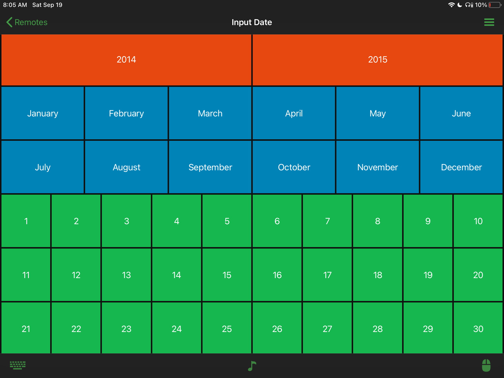

# InputDate Remote

This is a remote for inputting specific year, month and date. Made it because I had to rename and input a couple dates in YYMMDD format and after inputting two manually, I had to semi-automate the process. The automation part took way too long. 

## Color Palette
Dark Mode

Light Mode

## Screenshots of Layout
Dark Mode

Light Mode

## Acknowledgement
* [Unified Remote Docs](https://github.com/unifiedremote/Docs)
* [Wikimedia Commons for the Logo](https://commons.wikimedia.org/wiki/File:Calculator_icon.svg)
* Coolors for the Palette